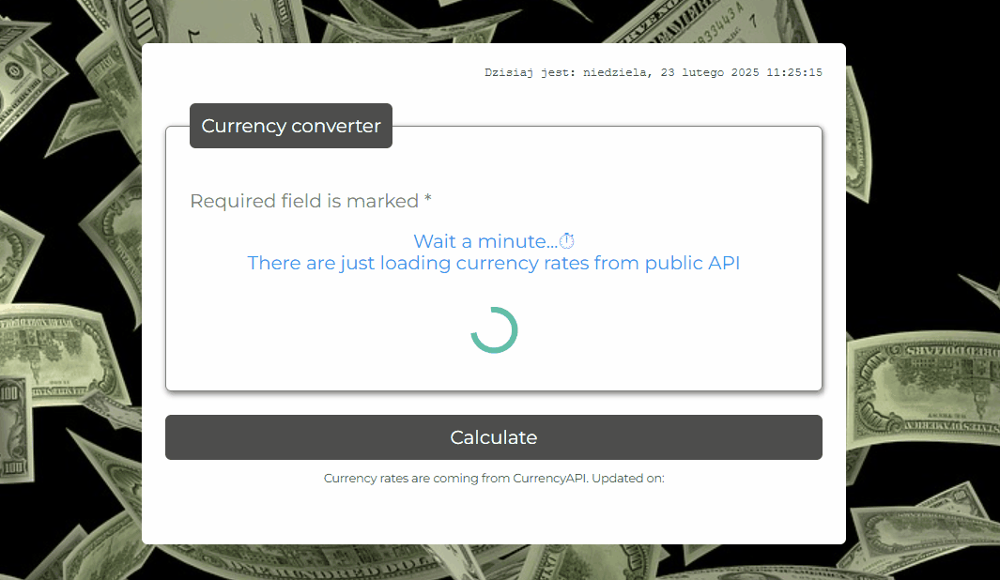

# Currency-Converter

## How to use:

The Currency-Converter is a simple calculation form where you can convert PLN into a few foreign currency.

I believe that additional explanation is no needed 😉 

On the following gif you can see how to use it -> let's check it out 😎

## Calculation form you can find under the following link:

[currency conventer](https://kantares77.github.io/currency-conventer-react/)

## Technologies

- HTML

- CSS

- BEM

- Grid

- JavaScript

- React